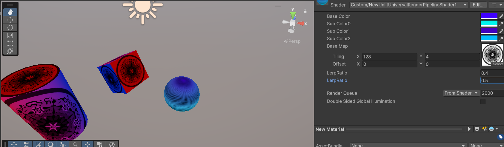
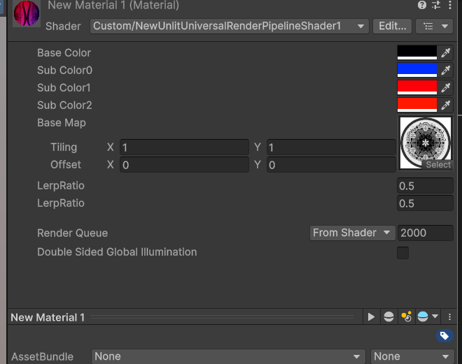

# はじめに
プログラムワークショップⅣの第2回の管理用です

# 結果画像

- 工夫した点：
Lerpで使用する色の数を増やした点、使用する法線情報をｙに変更し球体にマテリアルを割り当てたときグラデーションが縦向きに変化するようにした点。
IN.normal.ｙ*0.5+0.5の*0.5や+0.5の値を変えてグラデーションする比率を変更した。
プロパティを用いてunity上でスライダーを使って変更できるようにすることは試したがエラーが出てしまい、うまく設定できなかったのでやり方を調べて次回までにできるようにしておきたい。
floatならうまくいったが、Rangeの場合だとShader error in '': Parse error: syntax error, unexpected TVAL_ID at line 10というエラーが出た。
結果画像には設定を変更してほかの形状のオブジェクトに割り当てたものも含まれている。
以下の画像は球体以外のオブジェクトのマテリアルの設定。

# 進め方

- 本リポジトリ(tpu-game-2025/PGWS4_2)をforkしてください。
- fork先のリポジトリを更新してください
- Unityのプロジェクトをsrc内で進めて下さい。
- 結果を画面キャプチャして、画像としてリポジトリに追加して、上記のリンクから見れるようにしてください。
- 完成したら本リポジトリのmainブランチにpull requestを投げてください

